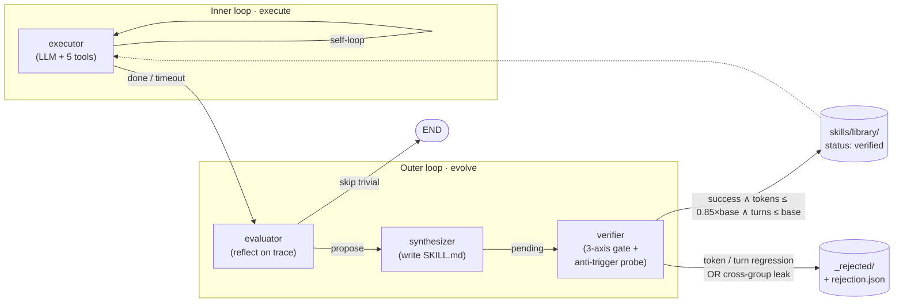

# Mercury — Self-Evolving Skill Synthesis Agent

A LangGraph harness that watches its own execution traces, synthesises Anthropic-spec [Agent Skills](https://docs.anthropic.com/en/docs/agents/skills) from them, and admits each candidate only after passing a deterministic three-axis gate inside an isolated Docker sandbox.

> **Status**: 7 / 7 days ✅ · 16 tasks · 139 offline tests · 2 verified skills · see [ROADMAP.md](./ROADMAP.md)

## Architecture



- **executor** — one LLM call + tool execution per invocation; self-loops until `submit` passes, `max_steps` hits, or three turns produce no tool calls. Tools: `python_repl` (Docker), `read_file`, `write_file`, `load_skill`, `submit`.
- **evaluator** — gated by `should_evaluate(state)`: skips trivial successes (turns < 4 ∧ pass), always reflects on failures and long traces. Emits a structured proposal via `bind_tools([emit_skill_proposal])`.
- **synthesizer** — pure I/O. Writes `skills/library/<kebab-name>/SKILL.md` with `status: pending` + the run's `baseline_metrics`.
- **verifier** — replays the source task + a same-group neighbour + one cross-group **anti-trigger** task. Promotes only if all three axes hold; otherwise moves the skill dir under `_rejected/<name>__<ts>/` with a `rejection.json` post-mortem.

## Headline result (16 tasks · 6 groups · Qwen-Plus)

| Metric              | baseline | evolved | Δ                       |
| ------------------- | -------- | ------- | ----------------------- |
| Pass@1              | 93.75%   | 87.50%  | −6.25% · **g = −1.00**  |
| avg tokens / task   | 16 049   | 19 026  | ×1.185                  |
| avg turns / task    | 5.56     | 6.06    | ×1.090                  |
| Skills synthesised  | —        | 2 verified, several rejected | — |

The evolved bench *underperforms* baseline — and that's the most interesting result of the project. The full story is in [`docs/BENCHMARK_SUMMARY.md`](./docs/BENCHMARK_SUMMARY.md), but in one sentence: a skill that passes the per-skill 3-axis gate can still hurt aggregate performance via false-positive triggering on sibling tasks within its same group; the gate's 1-neighbour sample is insufficient to catch that, and **the regression itself is evidence that the verifier mechanism is load-bearing** — without it, every synthesis would be merged blindly and the bench would be much worse. See [`docs/RESUME.md`](./docs/RESUME.md) for the interview narrative around this finding.

## Quickstart

```powershell
uv sync                                       # installs deps; uv picks Python 3.12
cp .env.example .env                          # set DASHSCOPE_API_KEY
uv run python scripts/pull_docker_image.py    # builds mercury-sandbox:latest

# Single-task debug
uv run mercury run --task csv-001 --mode baseline

# Full evolve+bench cycle (≈80–150K tokens depending on cache hits)
uv run mercury reset                          # wipe library + state.db
uv run mercury bench --mode baseline          # → results/metrics_baseline.json
uv run mercury evolve                         # synth + inline verify
uv run mercury bench --mode evolved           # → results/metrics_evolved.json
uv run mercury report                         # comparison table + 3 PNGs
```

Per-role models (each falls back to `QWEN_PLUS_MODEL` when unset):

```bash
EXECUTOR_MODEL=qwen-flash    # weaker → longer traces → more synthesis triggers
EVALUATOR_MODEL=qwen-plus    # smarter reflection
FLASH_MODEL=qwen-flash       # reserved for the optional pre-screen
```

The verifier's probe runs always reuse `EXECUTOR_MODEL` — `baseline_metrics` were captured under that model, so a mismatched probe would make the 0.85× token budget meaningless.

## Stack

- **Orchestration**: LangGraph 0.2 `StateGraph` + `SqliteSaver` checkpointer (`results/state.db`)
- **LLM**: Qwen3.6 (`qwen-plus` / `qwen-flash`) via DashScope's OpenAI-compatible endpoint; per-role assignment via env; global prompt cache (`langchain` `SQLiteCache` → `results/prompt_cache.db`)
- **Sandbox**: Docker SDK + custom `mercury-sandbox:latest` image (Python 3.11-slim + pandas / numpy / lxml / bs4 / chardet baked in, since the container runs `network=none` and can't pip-install at runtime)
- **Eval**: 16 deterministic data-wrangling tasks across `csv` / `json` / `log` / `multi` / `pipeline` / `xml`. Acceptance is **always** a Python `accept(workspace) → (bool, str)` — never an LLM judge.
- **Tests**: 139 passing offline; Docker / real-LLM tests opt-in (`tests/test_sandbox.py`, `tests/test_tools_e2e.py`, `tests/test_llm.py`)

## Repository layout

```
src/mercury/
├── nodes/         # executor / evaluator / synthesizer / verifier
├── sandbox/       # DockerSandbox (long-lived container + exec_run + tar inject)
├── skills/        # SkillFrontmatter schema + loader (parse / scan / load_full)
├── eval/
│   ├── tasks/     # csv-* / json-* / log-* / multi-* / pipeline-* / xml-*
│   ├── runner.py  # run_one_task / run_bench
│   ├── metrics.py # compute / normalized_gain / compare
│   └── plots.py   # 3 figures (bar / line / radar)
├── graph.py       # build_app() — wires the right edges per mode
├── tools.py       # 5 StructuredTools constructed per-run
├── state.py       # AgentState (TypedDict) + TraceCard / TraceStep schema
└── cli.py         # mercury {run, list-tasks, bench, evolve, report, reset}
```

Deeper module-level reference: [`docs/architecture.md`](./docs/architecture.md). Design rationale and the originating proposal: [`docs/Agent 项目构思与选型.md`](./docs/Agent%20项目构思与选型.md).
